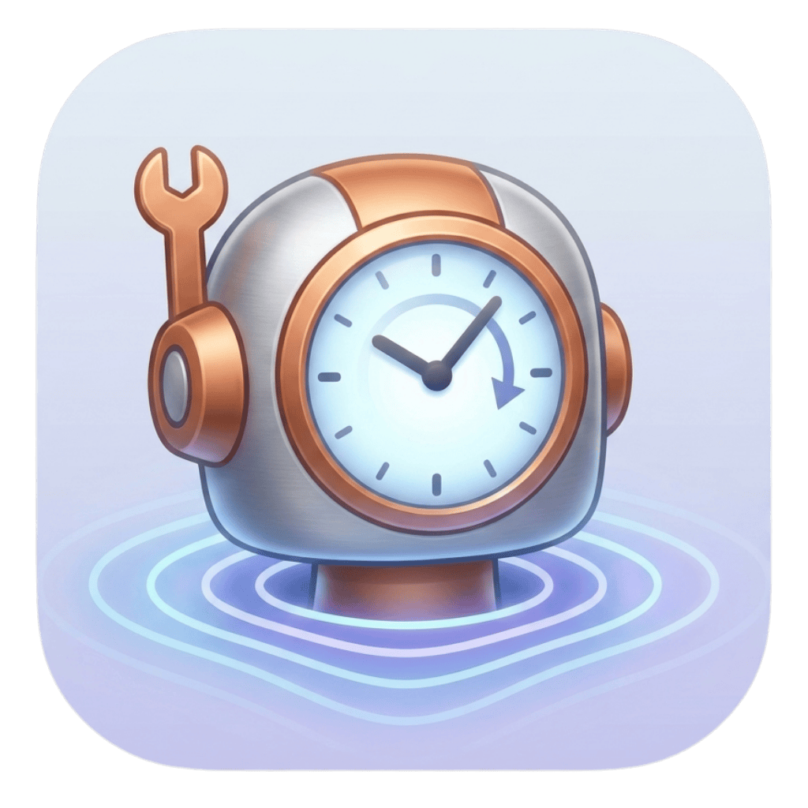
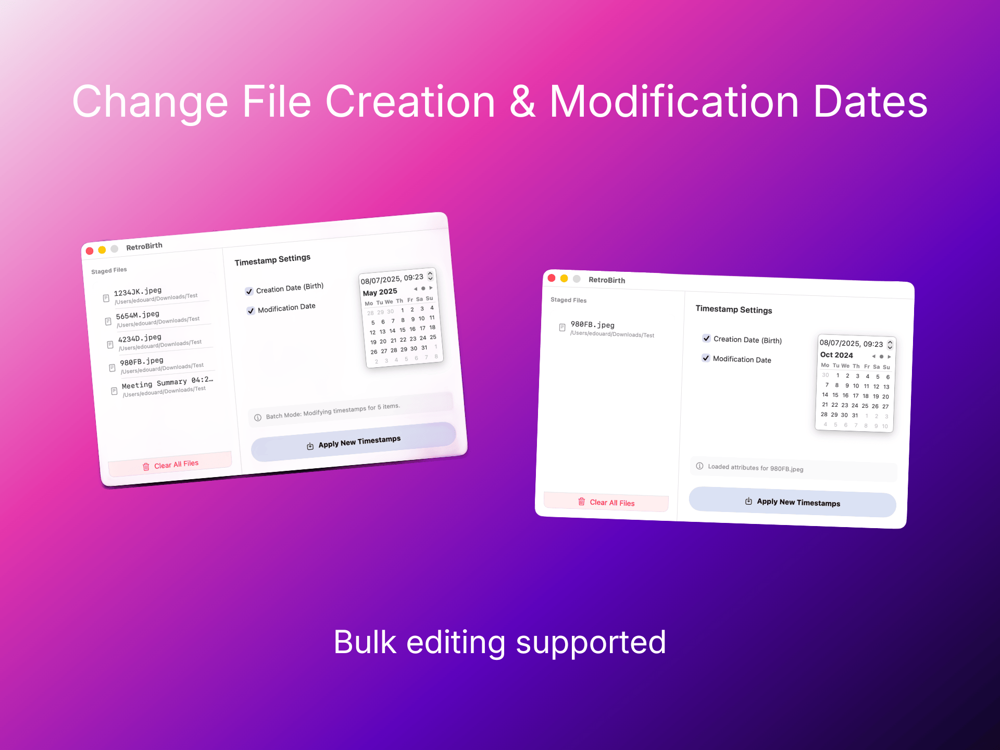

# RetroBirth — Change File Creation & Modification Dates

  

  <strong>An ultra-lightweight, native SwiftUI utility to seamlessly restore, correct, and rewrite file creation and modification timestamps on macOS.</strong>

  <a href="#-installation--download"><strong>Buy on Mac App Store</strong></a> | 
  <a href="https://github.com/edbot-sasu/RetroBirth/releases"><strong>Download Free Binary</strong></a>

---

## ✨ Features

* **Date override :** overwrite create and update date.
* **Batch Processing:** Drop one file or hundreds of mixed files simultaneously.
* **Ultra-Thin Desktop Interface:** No bulky windows, no bloated setup wizards—just a sleek, native SwiftUI interface.
* **Zero Resource Footprint:** Built completely bare-metal using standard Foundation file system hooks. No tracking, no background helpers, no bloat.

  

## 🚀 Installation & Download

### Option A: The Mac App Store (Recommended)
Support independent open-source software! Purchasing via the App Store ensures you get seamless, automatic background updates, native Apple sandboxed security, and a hassle-free one-click installation.
> 📥 **[Get Retro Birth on the Mac App Store (€4.99)](#)** *(Link your App Store URL here)*

### Option B: Free GitHub Release (Manual)
If you are a developer or power-user, you can download the pre-compiled application bundle absolutely free.
1. Head over to the [Releases](https://github.com/YOUR_GITHUB_USERNAME/retro-birth/releases) tab.
2. Download `RetroBirth.zip`, extract it, and drop it into your Applications folder.
3. *Note: Because this binary is self-compiled outside the App Store ecosystem, you will need to right-click the application icon and select **Open** to clear macOS Gatekeeper the first time.*
